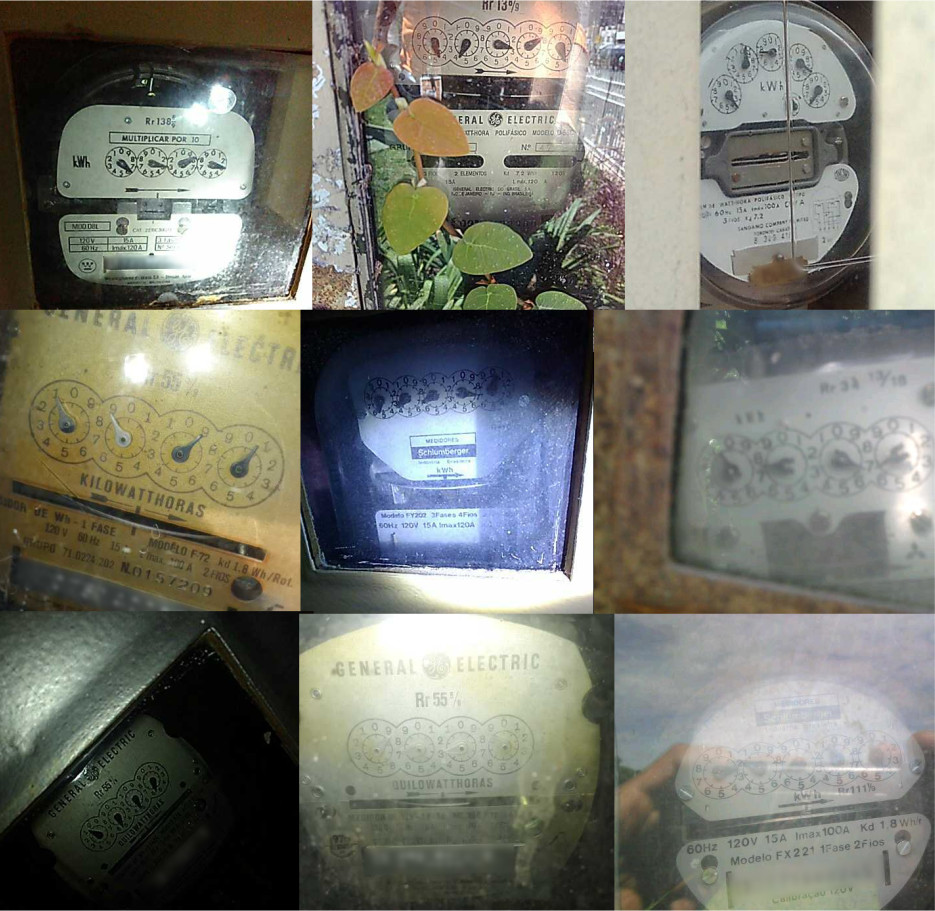

# UFPR-ADMR-v2 Dataset

The UFPR-ADMRv2 dataset contains 5,000 dial meter images obtained on-site by employees of the Energy Company of Paraná (Copel), which serves more than 4M consuming units in the Brazilian state of Paraná. The images were acquired with many different cameras and are available in the JPG format with 320×640 or 640×320 pixels (depending on the camera orientation). More details are available in our paper [currently under review].

The dataset is split into three subsets: training (3,000 images), validation (1,000 images) and testing (1,000 images). Every image has the following annotations available in a .txt file: the counter’s corners (x1, y1), (x2, y2), (x3, y3), (x4, y4). The corners can be used to rectify the counter patch and represent, respectively, the top-left, top-right, bottom-right, and bottom-left corners. For each dial, the current position (x, y, w, h) and the corresponding reading (the final reading as well as the approximate reading with one decimal place precision). All counters of the dataset (regardless of meter type) have 4 or 5 dials; thus, 22,410 dials were manually annotated. The full details and statistics regarding the dataset are available in our paper.

Here are some examples from the dataset:  

## How to obtain the dataset

The UFPR-ADMR-v2 dataset is the property of the Energy Company of Paraná (Copel) and is released **only** to academic researchers from educational or research institutes for **non-commercial purposes**. 

To be able to download the dataset, please read carefully [**this license agreement**](./pdfs/license-agreement.pdf), fill it out and send it back to Professor David Menotti ([menotti@inf.ufpr.br](mailto:menotti@inf.ufpr.br)). The license agreement MUST be reviewed and signed by the individual or entity authorized to make legal commitments on behalf of the institution or corporation (e.g., Department/Administrative Head, or similar). **We cannot accept licenses signed by students or faculty members.**

## Related publications

A list of all papers on AMR published by us can be seen [here](https://scholar.google.com/scholar?hl=pt-BR&as_sdt=0%2C5&as_ylo=2019&q=allintitle%3A+meter+reading+author%3A%22David+Menotti%22&btnG=).

## Contact

Please contact Professor David Menotti ([menotti@inf.ufpr.br](mailto:menotti@inf.ufpr.br)) with questions or comments.
